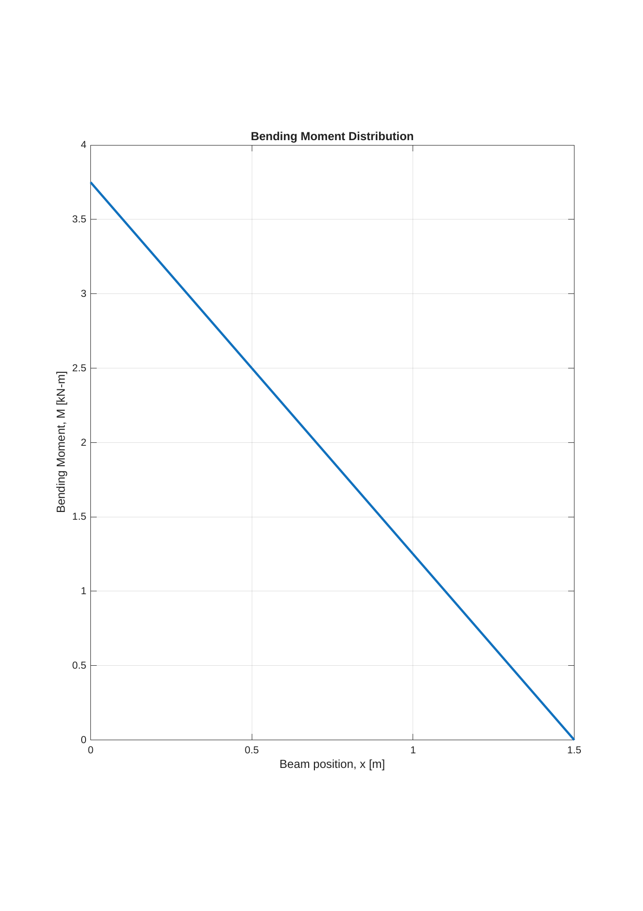
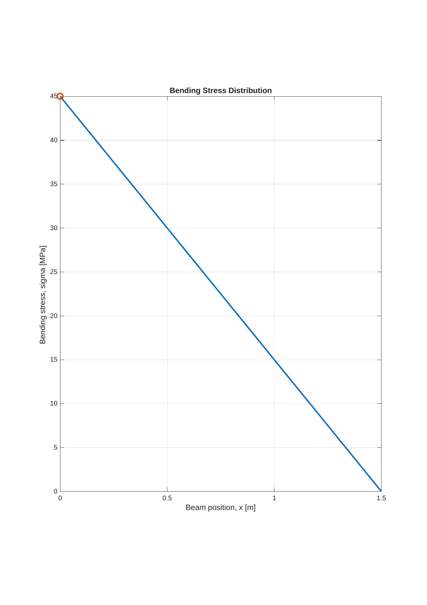
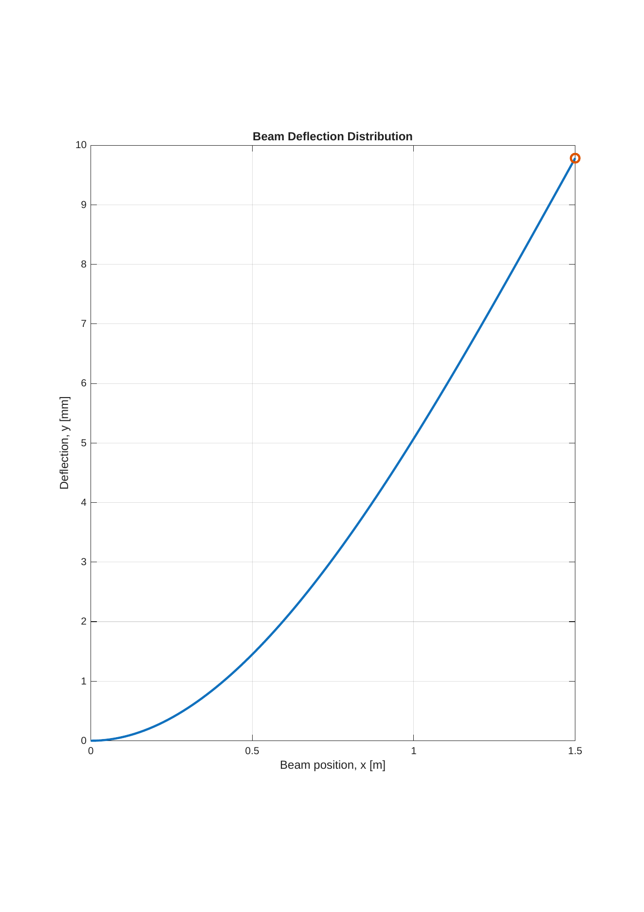
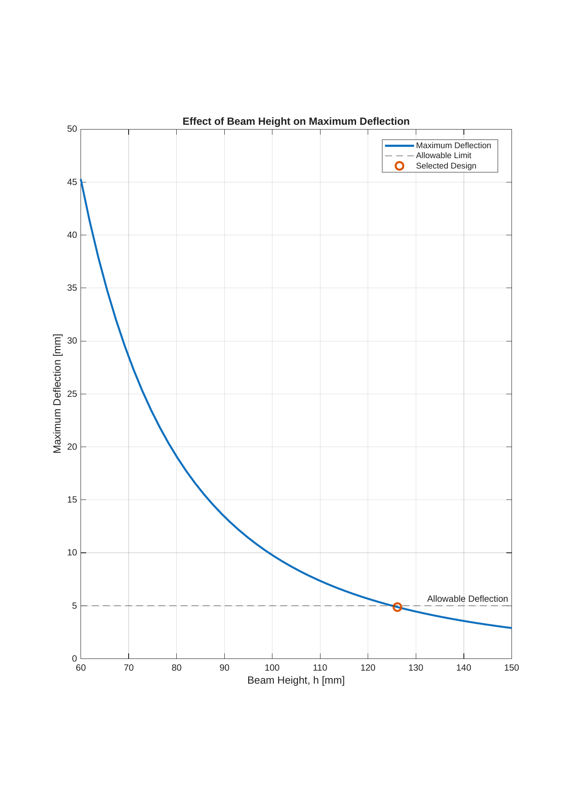
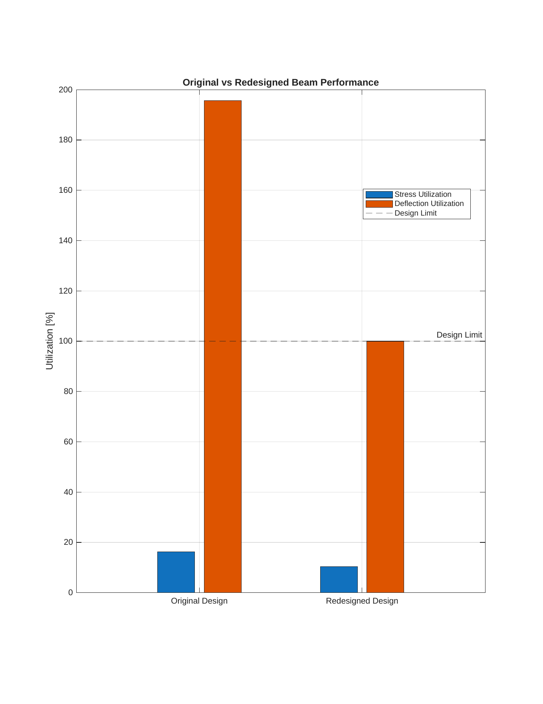

# Cantilever Beam Structural Load & Design Analyzer — MATLAB

A MATLAB engineering analysis project for a rectangular cantilever beam under an end point load. The model evaluates structural response, checks strength and serviceability independently, calculates allowable loads, sizes the section, validates a redesign, and performs a 50-point parametric study to identify a feasible geometry.

## Engineering objective

A 1.5 m cantilever beam with a 50 mm × 100 mm rectangular cross-section is subjected to a 2.5 kN point load at the free end. The material properties used are representative of aluminium: Young's modulus of 69 GPa and yield strength of 276 MPa.

The analysis answers two separate design questions:

1. **Strength:** Is the maximum bending stress below the material yield strength?
2. **Serviceability:** Is the maximum tip deflection below the prescribed 5 mm limit?

The key result is that the baseline beam is safe against yielding but fails the deflection requirement. In this case, **stiffness — not strength — governs the design**.

## Baseline inputs

| Parameter | Value |
|---|---:|
| Beam length, `L` | 1.50 m |
| Width, `b` | 50 mm |
| Height, `h` | 100 mm |
| Young's modulus, `E` | 69 GPa |
| End load, `F` | 2.50 kN |
| Yield strength, `σy` | 276 MPa |
| Allowable tip deflection | 5 mm |

## Analytical model

For the rectangular section:

```text
I = b h^3 / 12
c = h / 2
Z = I / c
```

For a cantilever with an end point load:

```text
M(x)     = F(L - x)
sigma(x) = M(x)c / I
y(x)     = F x^2 (3L - x) / (6EI)
theta(x) = F x (2L - x) / (2EI)
```

The script also evaluates support reactions, shear force, bending strain, factor of safety, critical locations, yield-load capacity, deflection-based load capacity, and strength/serviceability utilization.

## Baseline results

| Output | Result |
|---|---:|
| Maximum bending moment | **3.75 kN·m** |
| Maximum bending stress | **45.00 MPa** |
| Maximum deflection | **9.78 mm** |
| Yield factor of safety | **6.13** |
| Maximum strain | **652.17 µε** |
| Maximum slope | **0.5605°** |
| Yield-load capacity | **15.33 kN** |
| Deflection-based load limit | **1.278 kN** |
| Stress utilization | **16.30%** |
| Deflection utilization | **195.65%** |

### Baseline design decision

- **Yield check:** PASS
- **5 mm deflection check:** FAIL
- **Overall design:** FAIL
- **Governing criterion:** **Deflection / stiffness**

This illustrates an important structural-design point: a component can have a large margin against yielding and still be unacceptable because of excessive deformation.

## Structural response

### Bending moment distribution



The maximum bending moment is 3.75 kN·m at the fixed support and decreases linearly to zero at the free end.

### Bending stress distribution



The maximum bending stress is 45 MPa at the fixed support and decreases with the bending moment toward the free end.

### Beam deflection



The maximum deflection occurs at the free end and reaches approximately 9.78 mm.

## Load-capacity checks

Two load limits are evaluated independently:

- **Yield-limited load:** 15.33 kN
- **Deflection-limited load for 5 mm tip deflection:** 1.278 kN

Since the applied load is 2.50 kN, the beam remains far below the yield-load capacity but exceeds the serviceability-based load limit. The deflection requirement therefore governs.

## Analytical section sizing

The beam width is held fixed at 50 mm while the required height is calculated independently from the yield and deflection constraints.

### Yield-limited height

```text
h_strength = sqrt(6 F L / (b sigma_y))
```

Result:

**h_strength = 40.38 mm**

This is the height corresponding to the onset of yielding for the specified load; it is not a production design safety factor requirement.

### Deflection-limited height

Using the rectangular-section moment of inertia in the cantilever tip-deflection equation:

```text
h_deflection = [4 F L^3 / (E b y_allow)]^(1/3)
```

Result:

**h_deflection = 125.07 mm**

Therefore:

**Required analytical height = max(h_strength, h_deflection) = 125.07 mm**

The redesign is governed by **deflection**, not material strength.

## Redesign validation

Keeping the width fixed at 50 mm and increasing the height to the analytically required value gives:

| Metric | Original | Redesigned |
|---|---:|---:|
| Beam height | 100 mm | 125.07 mm |
| Maximum stress | 45.00 MPa | 28.77 MPa |
| Maximum deflection | 9.78 mm | 5.00 mm |
| Yield factor of safety | 6.13 | 9.59 |
| Deflection utilization | 195.65% | 100.00% |

Design changes:

- Height increase: **25.07%**
- Stress reduction: **36.07%**
- Deflection reduction: **48.89%**

## Parametric design study

A 50-point study evaluates beam heights from 60 mm to 150 mm. For every candidate geometry, MATLAB recalculates:

- second moment of area
- maximum bending stress
- maximum deflection
- factor of safety
- strength feasibility
- serviceability feasibility

The first discrete design satisfying both constraints is approximately **126.12 mm**. At that height, the predicted maximum deflection is approximately **4.88 mm** and the maximum bending stress is approximately **28.29 MPa**.

The discrete parametric result differs from the analytical requirement of 125.07 mm by only about **0.84%**, providing an internal cross-check of the sizing logic.



The nonlinear decrease in deflection reflects the strong relationship:

```text
y_max ∝ 1 / h^3
```

## Original vs redesigned performance



The utilization plot makes the governing constraint explicit: the original section uses only about 16% of its yield capacity but nearly 196% of the allowable deflection. The analytically redesigned beam reduces deflection utilization to 100% while retaining a large strength margin.

## MATLAB concepts demonstrated

- vectorized calculations and element-wise operations
- logical indexing and critical-location extraction
- `max`, `min`, `find`, and array indices
- conditional statements
- `for` loops
- preallocation with `zeros`
- formatted engineering output with `fprintf`
- engineering plots and design-limit visualization
- parametric design-space exploration

## Repository contents

```text
cantilever-beam-structural-analyzer/
├── cantilever_beam_structural_analyzer.m
├── README.md
├── LICENSE
├── .gitignore
├── key_results.md
├── matlab_workspace_results.pdf
├── figure1_bending_moment.png
├── figure1_bending_moment.pdf
├── figure2_bending_stress.png
├── figure2_bending_stress.pdf
├── figure3_deflection.png
├── figure3_deflection.pdf
├── figure4_height_deflection_study.png
├── figure4_height_deflection_study.pdf
├── figure5_original_vs_redesigned.png
└── figure5_original_vs_redesigned.pdf
```

The PNG files are embedded in this README; PDF versions are included for higher-resolution viewing. `key_results.md` provides a concise numerical summary, and `matlab_workspace_results.pdf` records the completed MATLAB workspace.

## Running the model

1. Open MATLAB or MATLAB Online.
2. Open `cantilever_beam_structural_analyzer.m`.
3. Modify the input parameters at the top of the script if required.
4. Run the complete script.
5. Review the Command Window, Workspace, and five generated figures.

No specialized MATLAB toolboxes are required for the current implementation.

## Assumptions and limitations

The model uses Euler–Bernoulli beam theory and assumes:

- linear-elastic material behavior
- small deflection
- constant rectangular cross-section
- prismatic beam
- ideal fixed support
- point load at the free end
- bending-dominated response

The current implementation does not include shear deformation, geometric nonlinearity, buckling, fatigue, stress concentrations, distributed loading, or finite-element validation. The strength sizing boundary uses material yield strength directly; a real design would additionally apply the required design standard, prescribed factor of safety, load combinations, and material allowables.

## Engineering takeaway

The central result is not simply the 45 MPa bending stress. The analysis demonstrates that **strength and stiffness must be assessed independently**. Although the initial beam has a yield factor of safety of approximately 6.13, its 9.78 mm tip deflection violates the 5 mm serviceability requirement.

Analytical sizing gives a required height of **125.07 mm**, while an independent 50-point parametric search identifies the first feasible discrete geometry at **126.12 mm**. Both methods therefore identify **deflection as the governing design constraint**.

## License

Licensed under the MIT License. See the `LICENSE` file for details.
